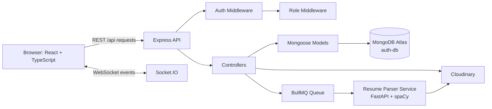
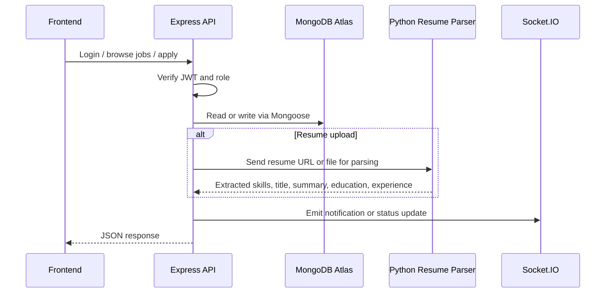
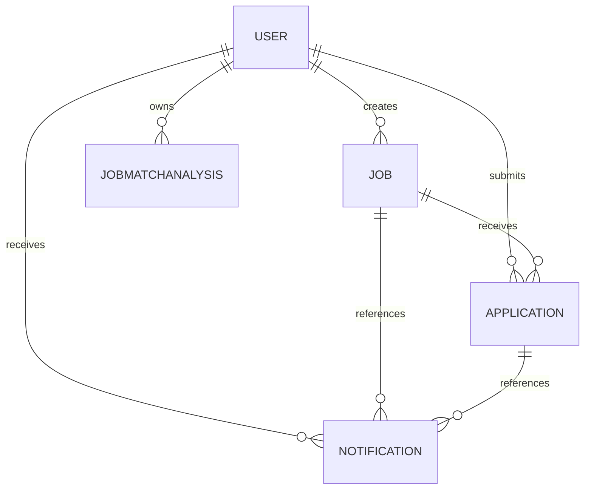

# Lakshya


## Why this project is recruiter-friendly

- It shows end-to-end product thinking, not just isolated UI pages.
- It uses a realistic hiring flow with job posting, applications, shortlisting, interviews, and hiring outcomes.
- It includes a Python microservice for resume parsing, which makes the architecture feel production-ready.
- It uses JWT authentication, role-based authorization, and protected API routes.
- It stores structured business data in MongoDB with Mongoose models and indexed query paths.

## Core Capabilities

### Job Seekers

- Browse and search jobs with filters.
- Save jobs and track applications.
- Upload a resume and let the system extract profile data automatically.
- View job match analysis with matched skills, missing skills, and suggestions.
- Receive notifications when application status changes.

### Recruiters

- Create, edit, publish, and close jobs.
- Review applications with match score, experience, and skill insights.
- Move candidates through application stages.
- Schedule interviews and manage outcomes.
- Monitor candidate activity with application and job analytics.

### Admins

- Access platform-level dashboards and oversight routes.
- Manage system-wide job and user workflows.
- Support moderation and operational control across the platform.

## Tech Stack

### Frontend

- React 19
- TypeScript
- Vite
- React Router
- React Query
- React Hook Form
- Socket.IO client
- Tailwind CSS
- Framer Motion
- Recharts

### Backend

- Node.js
- Express.js
- Mongoose
- MongoDB Atlas
- JWT authentication
- bcrypt password hashing
- Multer file uploads
- Socket.IO
- BullMQ background jobs
- Cloudinary storage

### Resume Parser Service

- Python
- FastAPI
- spaCy
- sentence-transformers
- pdfplumber
- docx2txt

## System Architecture



## Request Flow



## Folder Structure

```text
Lakshya/
├── lakshyafrontend/          # React frontend
├── lakshyabackend/           # Express API and data layer
├── resume-parser-service/     # Python resume parsing microservice
├── cypress/                  # End-to-end tests
├── README.md                 # Main project overview
├── SETUP.md                  # Setup guide
└── start-all-services.ps1    # Local startup helper
```

## Database Design

Lakshya uses **MongoDB Atlas** through **Mongoose**. The active connection string in the backend environment targets the MongoDB database named `auth-db`. Several scripts also support local MongoDB usage with the `lakshya` database name for development and verification.

### Collections

- `users`: identity, role, soft-delete state, resume details, and recruiter/job-seeker profile fields.
- `jobs`: job posts, salaries, skills, requirements, status, and ownership.
- `applications`: user-job applications, status transitions, interview details, and match metadata.
- `notifications`: read/unread notifications for application events and recruiter actions.
- `jobmatchanalyses`: match scoring snapshots for a user-job pair.
- `posts`: legacy or simplified job post records used by older flows.
- `auditlogs`: system activity and operational trace records.



### Model Highlights

- `User`
	- Stores `name`, `email`, `number`, `role`, soft-delete flags, resume data, recruiter metadata, and job-seeker profile fields.
- `Job`
	- Stores title, description, company, location, salary, skills, category, job type, remote type, status, and ownership.
- `Application`
	- Stores application state, match score, matched and missing skills, interview rounds, and withdrawal data.
- `Notification`
	- Stores recipient, type, message, read state, and references back to job or application records.
- `JobMatchAnalysis`
	- Stores a durable analysis record for one user-job pair with semantic and skill-based scoring.

## API Surface

The backend exposes route groups for the main product areas:

- `/api/auth` for register, login, password recovery, and token-related flows.
- `/api/profile` for profile updates, resume uploads, and avatar management.
- `/api/jobs` for browsing, creating, updating, and managing jobs.
- `/api/applications` for application submission and workflow updates.
- `/api/recruiter` for recruiter dashboards and application operations.
- `/api/job-seeker` for matching, recommendations, and candidate-facing tools.
- `/api/admin` for protected admin workflows.
- `/api/notifications` for notification feed and read-state updates.

## Local Setup

### Prerequisites

- Node.js 20+
- npm 9+
- MongoDB Atlas or a local MongoDB instance
- Python 3.8+ for the resume parser service

### Backend

```bash
cd lakshyabackend
npm install
```

Create `lakshyabackend/.env`:

```env
PORT=3000
MONGO_CONN=<your-mongodb-connection-string>
JWT_SECRET=<your-jwt-secret>
EMAIL_USER=<your-email>
EMAIL_PASS=<your-email-password>
CLOUDINARY_CLOUD_NAME=<your-cloud-name>
CLOUDINARY_API_KEY=<your-api-key>
CLOUDINARY_API_SECRET=<your-api-secret>
GROQ_API_KEY=<optional-ai-key>
RESUME_PARSER_URL=http://localhost:8000
FRONTEND_URL=http://localhost:5173
```

Run the API:

```bash
npm run dev
```

### Frontend

```bash
cd lakshyafrontend
npm install
npm run dev
```

Build the frontend for production:

```bash
npm run build
```

### Resume Parser Service

```bash
cd resume-parser-service
python -m venv venv
venv\Scripts\activate
pip install -r requirements.txt
python -m spacy download en_core_web_sm
python main.py
```

## Default Local URLs

| Service | URL |
|---|---|
| Frontend | http://localhost:5173 |
| Backend API | http://localhost:3000 |
| Resume parser | http://localhost:8000 |

## Engineering Decisions

- Separation of concerns is enforced through routes, middleware, controllers, services, and models.
- JWT-based authentication keeps the API stateless and easier to scale.
- Role middleware keeps recruiter and admin actions isolated from general user flows.
- MongoDB indexes are used for common lookups such as user role, job filters, application state, and match sorting.
- Resume parsing is isolated in a Python service so heavy NLP work does not block the Node API.
- Socket.IO is used for real-time notification and status updates.
- Cloudinary handles file storage so uploaded resumes and images do not bloat the app server.

## Why the Architecture Works

Lakshya is structured like a real hiring platform:

1. The browser talks to the Express API through REST and real-time sockets.
2. The backend validates authentication and authorization before business logic runs.
3. Mongoose models persist the state of users, jobs, applications, notifications, and match analysis.
4. The resume parser service handles document extraction and semantic enrichment.
5. Background jobs and notifications keep the product responsive while still supporting heavier workflows.

## Improvements You Could Add Next

- Add stronger request validation across all write endpoints.
- Add automated tests for the resume parsing and application state transitions.
- Add refresh-token rotation and token revocation.
- Add rate limiting for authentication and upload routes.
- Add observability for queue jobs, parser latency, and notification delivery.

## Summary

Lakshya demonstrates a full-stack production-style architecture with React, TypeScript, Node.js, Express, MongoDB Atlas, Mongoose, Socket.IO, BullMQ, Cloudinary, and a Python resume parsing microservice. It is a strong portfolio project because it shows product scope, backend design, real-time communication, and a clear hiring workflow.

